# ai-planting-method

## **A. Sentinel-1 Timeseries Extraction Pipeline**
### Overview

This pipeline extracts Sentinel-1 (VH polarization) time series data for agricultural field monitoring using Google Earth Engine. It processes biweekly composites, applies advanced cloud masking, temporal interpolation, and exports data as TFRecord for machine learning applications

Features
1. Data Processing
    - Sentinel-1 SAR data: VH polarization, descending plot 
    - Temporal Resolution: Biweekly composite (14 days interval)
    - Spatial Resolution: 10 m 
2. Preprocessing
    - Speckle reduction (Refined Lee Filter)
    - Temporal linear interpolation to fill gaps 
    - Masking using ESA WorldCover Cropland and DEM
3. Export  
    - TFRecord Format for deep learning (256 x 256 patches)

### Pipeline Workflow

```mermaid
graph LR
    A[📥 Load] -->|Filter| B[✨ Filter]
    B -->|Denoise| C[🕰️ Composite]
    C -->|14-day| D[🔄 Interpolate]
    D -->|Fill gaps| E[🎭 Mask]
    E -->|Optional| F[💾 Export TFRecord]
    
    subgraph "Output Formats"
        F1[🧠 TFRecord]
        F --> F1
    end
```


### Installation & Setup

1. Prerquisites
```bash
!pip install rasterio
!pip install geopandas
```
2. Earth Engine Authentication 
```python
import ee
from google.oauth2 import service_account

# Service Account (recommended for automation)
credentials = service_account.Credentials.from_service_account_file(
    'path/to/your-service-account-key.json',
    scopes=['https://www.googleapis.com/auth/earthengine']
)
ee.Initialize(credentials, project='your-project-id')
```

### Usage Example
1. Create Sentinel-1 Time series Composite 
```python 
# Define area of interest
aoi = ee.Geometry.Rectangle([120.75, 15.76, 121.57, 16.76])

# Create interpolated time series
# aoi: tile 
# start_date: start of planting rice 
# end_date: harvesting of rice
# interval_days: 14 (biweekly)
# expected_count: expected number of bands for modelling purposes 
composite = create_linear_interpolated_timeseries(
    aoi=aoi,
    start_date='2024-10-01',
    end_date='2025-06-30',
    polarization='VH',
    interval_days=14,
    expected_count=18
)
```
2. Export as TFRecord 
```python 
# Export to Google Drive
export_tasks = export_composite_as_tfrecord(
    composite=composite_masked,
    tiles=tiles,
    output_folder='sentinel1_tfrecords',
    prefix='S1_dry2025',
    patch_size=256,
    scale=10
)

# Monitor progress
monitor_export_tasks(export_tasks)
```
### Output Formats
```bash 
output_folder/
├── S1_dry2025_tile_001.tfrecord.gz
├── S1_dry2025_tile_002.tfrecord.gz
├── S1_dry2025_tile_003.tfrecord.gz
└── ...

Each patch: 256x256 pixels @ 10m = 2.56km x 2.56km
Bands: 18 (0_VH through 17_VH)
```
### Data Specifications
Sentiel-1 Parameters 
- Instrument Mode: IW (Interferometric Swath Mode)
- Polarization: VH (Cross-polarization)
- Orbit: Descending only 
- Processing Level: GRD (Ground Range Detected)
- Pixel Spacing: 10 m

Temporal Parameters 
- Interval: 14 days 
- Timesteps: 18 composites 
- Interpolation: Linear between nearest neighbor
- Gap Fill: Forward/bakckward fill

### Acknowledgments

- Google Earth Engine Team
- ESA Copernicus Programme
- Sentinel-1 Mission Team