# ai-planting-method

## **A. Sentinel-1 Timeseries Extraction Pipeline**
### Overview

This pipeline extracts Sentinel-1 (VH polarization) time series data for agricultural field monitoring using Google Earth Engine. It processes biweekly composites, applies advanced cloud masking, temporal interpolation, and exports data as TFRecord for machine learning applications

Features
1. Data Processing
    - Sentinel-1 SAR data: VH polarization, descending plot 
    - Temporal Resolution: Biweekly composite (14 days interval)
    - Spatial Resolution: 10 m 
2. Preprocessing
    - Speckle reduction (Refined Lee Filter)
    - Temporal linear interpolation to fill gaps 
    - Masking using ESA WorldCover Cropland and DEM
3. Export  
    - TFRecord Format for deep learning (256 x 256 patches)

### Pipeline Workflow


### Installation & Setup

1. Prerquisites
```bash
!pip install rasterio
!pip install geopandas
```
2. Earth Engine Authentication 
```python
import ee
from google.oauth2 import service_account

# Service Account (recommended for automation)
credentials = service_account.Credentials.from_service_account_file(
    'path/to/your-service-account-key.json',
    scopes=['https://www.googleapis.com/auth/earthengine']
)
ee.Initialize(credentials, project='your-project-id')
```

### Usage Example
1. Create Sentinel-1 Time series Composite 
```python 
# Define area of interest
aoi = ee.Geometry.Rectangle([120.75, 15.76, 121.57, 16.76])

# Create interpolated time series
# aoi: tile 
# start_date: start of planting rice 
# end_date: harvesting of rice
# interval_days: 14 (biweekly)
# expected_count: expected number of bands for modelling purposes 
composite = create_linear_interpolated_timeseries(
    aoi=aoi,
    start_date='2024-10-01',
    end_date='2025-06-30',
    polarization='VH',
    interval_days=14,
    expected_count=18
)
```
2. Export as TFRecord 
```python 
# Configure export parameters
OUTPUT_FOLDER = 'tfrecord'  # Google Drive folder name
PREFIX = 'S1_composite_dry2025'
PATCH_SIZE = 256  # 256x256 pixel patches
SCALE = 10  # 10m resolution for Sentinel-2

# Start export
export_tasks = export_composite_as_tfrecord(
    composite=composite_mask,
    tiles=tiles,
    output_folder=OUTPUT_FOLDER,
    prefix=PREFIX,
    patch_size=PATCH_SIZE,
    scale=SCALE
)

# Monitor progress
monitor_export_tasks(export_tasks)
```

### Output Formats
```bash 
output_folder/
├── S1_composite_dry2025_tile_001.tfrecord.gz
├── S1_composite_dry2025_tile_002.tfrecord.gz
├── S1_composite_dry2025_tile_003.tfrecord.gz
└── ...

Each patch: 256x256 pixels 
Bands: 18 (0_VH through 17_VH)
```
### Data Specifications
Sentiel-1 Parameters 
- Instrument Mode: IW (Interferometric Swath Mode)
- Polarization: VH (Cross-polarization)
- Orbit: Descending only 
- Processing Level: GRD (Ground Range Detected)
- Pixel Spacing: 10 m

Temporal Parameters 
- Interval: 14 days 
- Timesteps: 18 composites 
- Interpolation: Linear between nearest neighbor
- Gap Fill: Forward/bakckward fill

## **B. Model Training Pipeline**
### Overview

This pipeline implements CNN-LSTM model to classify planting methods (Direct Seeded vs Transplanted) using Sentinel-1 time series data. The model combines Convolutional Neural Network (CNN) and Long Short Term Memory (LSTM) layers to capture both spatial and temporal patterns in Sentinel-1 SAR time series data. 

Features
1. Data Preprocessing
    - Data Loading 
    - Feature Engineering
        - Remove irrelevant columns 
        - Reshape data for LSTM inputs format (samples, sequence_length, features)
    - Class Balancing
    - Data Splitting : 80-20 train-test split with stratification 

2. Model Architecture (CNN-LSTM) : The model combines CNNs for feature extraction and LSTMs for sequence modelling 

3. Training Pipeline 
    - Loss Function : Weighted Cross-Entropy 
    - Optimizer : Adam with learning rate scheduling 
    - Mini-Batch Training : batch_size = 32 
    - Early Stopping : patience = 50
    - Model Checkpoint : Saves best model based on validation F1 score 
    - Metrics : 
        - Loss curve 
        - Accuracy 
        - F1 score 
        - Precision and Recall 

4. Evaluation

5. Model Saving and Deployment 
    - Best model saved 
    - Model weights saved
    - Training history plot saved analysis 
    - Model optimized for deployment (3 MB)

### Model Architecture
Model: **CNN-LSTM**

The model combines Convolutional Neural Networks (CNN) and Long Short-Term Memory (LSTM) networks to analyze temporal patterns in SAR data.

Key Components:
1. CNN Feature Extractor
    - Extracts spatial features from each timestep
    - 2 convolutional layers (64 → 128 channels)
    - Batch normalization and dropout for regularization

2. Bidirectional LSTM
    - Processes temporal sequences in both directions
    - 2 layers with 128 hidden units
    - Captures long-term dependencies in time series

3. Attention Mechanism
    - Focuses on important timesteps
    - Weighted aggregation of LSTM outputs

4. Classification Head
    - 2-layer fully connected network
    - Binary classification (Direct-Seeded vs Transplanted)

### Pipeline Workflow

```mermaid 
flowchart TB
    subgraph A[📚 Dataset Preparation]
        A1[📥 Load & Merge CSV Files]
        A2[🔧 Data Cleaning & Preprocessing]
        A3[⚖️ Handle Class Imbalance]
        A4[🔀 Train/Val/Test Split]
    end
    
    subgraph B[🤖 Model Configuration]
        B1[✨ Define CNN-LSTM Architecture]
        B2[⚙️ Set Training Hyperparameters]
        B3[⚖️ Configure Loss & Optimizer]
        B4[📊 Initialize Metrics Tracking]
    end
    
    subgraph C[🔄 Training Pipeline]
        C1[🎯 Epoch Loop]
        C2[📦 Mini-Batch Processing]
        C3[⚡ Forward & Backward Pass]
        C4[📈 Calculate Metrics]
        C5[🔍 Validation Phase]
    end
    
    subgraph D[🏆 Model Evaluation]
        D1[🧪 Test Set Inference]
        D2[📊 Performance Metrics]
        D3[📉 Confusion Matrix]
        D4[📈 Loss & Accuracy Curves]
    end
    
    subgraph E[💾 Model Management]
        E1[💿 Save Best Model Weights]
        E2[🗂️ Export Training Logs]
        E3[📋 Generate Model Report]
    end
    
    A --> B
    B --> C
    C --> D
    D --> E
    
    %% Annotations
    A2 -->|"Remove unnecessary columns<br>Convert labels to numerical"| A3
    B1 -->|"CNN for spatial features<br>LSTM for temporal patterns"| B2
    C5 -->|"Early stopping<br>patience=50"| D
    D2 -->|"F1: 0.8575<br>Accuracy: 79.81%"| E
    
    %% Styling
    style A fill:#e1f5fe,stroke:#01579b,stroke-width:2px
    style B fill:#f3e5f5,stroke:#4a148c,stroke-width:2px
    style C fill:#e8f5e8,stroke:#1b5e20,stroke-width:2px
    style D fill:#fff3e0,stroke:#e65100,stroke-width:2px
    style E fill:#fce4ec,stroke:#880e4f,stroke-width:2px
    
    classDef highlight fill:#ffeb3b,stroke:#f57c00,stroke-width:3px
    class D2 highlight
```

### Installation and Setup 
1. Setup Environment
    ```bash
    !pip install rasterio torchmetrics optuna torch torchvision
    ```
### Model Training 
```python
model = SimplifiedCNNLSTM(
        input_dim=18,
        hidden_dim=128,
        num_layers=2,
        num_classes=2,
        dropout_rate=0.4
).to(device)

# Focal Loss or weighted CrossEntropyLoss
# criterion = FocalLoss(alpha=0.25, gamma=2.0)
criterion = nn.CrossEntropyLoss(weight=class_weights)

optimizer = torch.optim.Adam(model.parameters(), lr=0.0001, weight_decay=0.01)
scheduler = ReduceLROnPlateau(optimizer, 'min', patience=10, factor=0.5)
# scaler = None  # Not needed for CPU

# # Train with mini-batches
model, history = train_model_full(
         model=model,
         X_train_tensor=X_train_tensor,
         y_train_tensor=y_train_tensor,
         X_test_tensor=X_test_tensor,
         y_test_tensor=y_test_tensor,
         criterion=criterion,
         optimizer=optimizer,
         scheduler=scheduler,
         scaler=scaler,
         device=device,
         save_path='/content/drive/MyDrive/AGRI/Planting_Method/model',
         season_type='dry',
         epochs=500,
         patience=50,
         use_batch_training=True,
         batch_size=32
)
```
## **C. Model Inference Pipeline**
### Overview 

This pipeline performs inference in Sentinel-1 SAR time series data to classify rice planting methods into two categories:
- Class 0: Direct Seeded Rice 
- Class 1: Transplanted Rice 

The inference pipeline processes TFRecord files conatining multi-temporal SAR imagery and generates georeference classification maps with cnfidence scores. 

### Architecture

1. Diagram

    ```bash
    Input (batch, 18, 1) 
        ↓
    CNN (Conv1D layers)
        ↓
    Bidirectional LSTM
        ↓
    Layer Normalization
        ↓
    Attention Mechanism
        ↓
    Fully Connected Layers
        ↓
    Output (batch, 2 classes)
    ```
2. Input Data 
    - TFRecord Structure
    ```bash 
    TFRECORD_DIR/
    ├── S1_composite_dry2025_tile_001-00000.tfrecord.gz
    ├── S1_composite_dry2025_tile_001-00001.tfrecord.gz
    ├── ...
    ├── S1_composite_dry2025_tile_001-mixer.json
    └── ...
    ```
    - Data Format
        - Bands: 18 timesteps of VH Polarization 
        - Band naming: **`{timestep}`**_VH (e.g., 0_VH, 1_VH, ..., 17_VH)
        - Patch size: 256x256 pixels
        - CRS: EPSG:4326 (WGS84)

3. Model Architecture 
    ```python
    SimplifiedCNNLSTM(
        input_dim=18,           # Number of timesteps
        hidden_dim=128,         # LSTM hidden units
        num_layers=2,           # LSTM layers
        num_classes=2,          # Binary classification
        dropout_rate=0.4        # Dropout rate
    )
    ```

4. Training Chekpoint 

    The model loads from a saved checkpoint containing:

    - **`model_state_dict`**: Trained weights
    - **`epoch`**: Training epoch number
    - **`best_accuracy`**: Validation accuracy

### Processing Pipeline

1. Initialization
    ```python 
    # Set device (GPU/CPU)
    device = torch.device('cuda' if torch.cuda.is_available() else 'cpu')

    # Configure paths
    MODEL_PATH = 'path/to/CNN-LSTM_dry_model.pth'
    TFRECORD_DIR = 'path/to/tfrecords'
    OUTPUT_DIR = 'path/to/results'
    ```

2. Tile Discovery

    The pipeline automatically disovers all tiles by 
    - Scanning TFRecord directory for **`.tfrecord.gz`** files 
    - Grouping files by the tile base name 
    - Loading georeferencing from **`mixer.json`**

3. Patch Processing 

    For each tile:
    - Load TFRecord files 
    - Extract time series for each 256x256 patch 
    - Reshape data to {pizels, timesteps, bands}
    - Filter valid ixels (non-NaN, non-zero)
    - Batch inference using CNN-LSTM
    - Generate classification nad confidence scores 

4. Output Generation 

    For each tile, the pipeline generates:
    - Classification map (0 = Direct Seeded, 1 = Transplanted)
    - Confidence map (0.0 - 1.0)
    - Visualization 

### Output Files 

1. Classification GeoTIFF

    Filename: **`tile_{number}_classification.tif`**
    - Values:
        - 0 = Direct Seeded Rice
        - 1 = Transplanted Rice 
        - 255 = No Data 
    - Data Type : UInt8 

2. Confidence GeoTIFF

    Filename: **`tile_{number}_confidence.tif`**
    - Values: 0.0 - 1.0 
    - Data Type: Float32
    - No Data: -9999

### Usage 

Basic Workflow 

1. Install Dependecies 
    ```python 
    !pip istall rasterio
    ```

2. Configure Paths
    ``python
    MODEL_PATH = '/path/to/model.pth'
    TFRECORD_DIR = '/path/to/tfrecords'
    OUTPUT_DIR = '/path/to/output'
    ```

3. Run Inference 

### Configuration 

Key Parameters 

```python 
PATCH_SIZE = 256           # Patch dimensions (pixels)
BATCH_SIZE = 512           # Inference batch size
SEQUENCE_LENGTH = 18       # Number of timesteps
EXPECTED_BANDS = 1         # Bands per timestep (VH)
```

### Acknowledgments

- Google Earth Engine Team
- ESA Copernicus Programme
- Sentinel-1 Mission Team